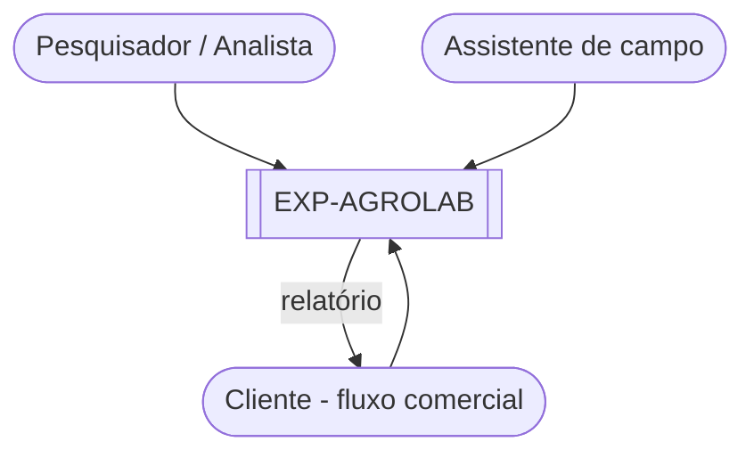
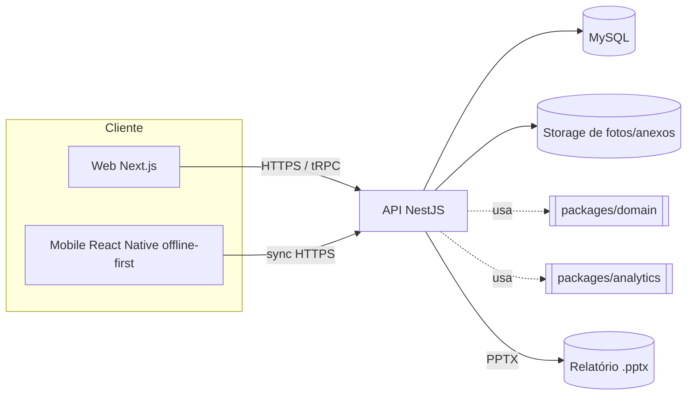
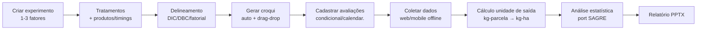
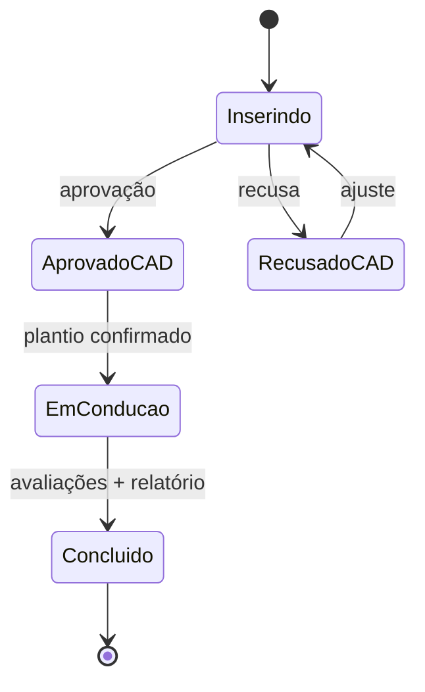
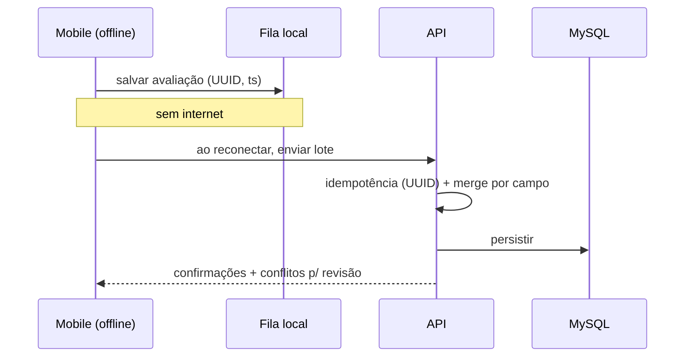

# 02 — Diagramas

Diagramas em Mermaid (renderizam no GitHub/preview).

## C4 — Contexto

## C4 — Containers

## Fluxo do experimento (alto nível)

## Estados do protocolo (fluxo comercial)

> Fluxo **interno** (TCC): pula `AprovadoCAD/RecusadoCAD`, vai de `Inserindo` direto a `EmConducao`.

## Sincronização offline (mobile)

