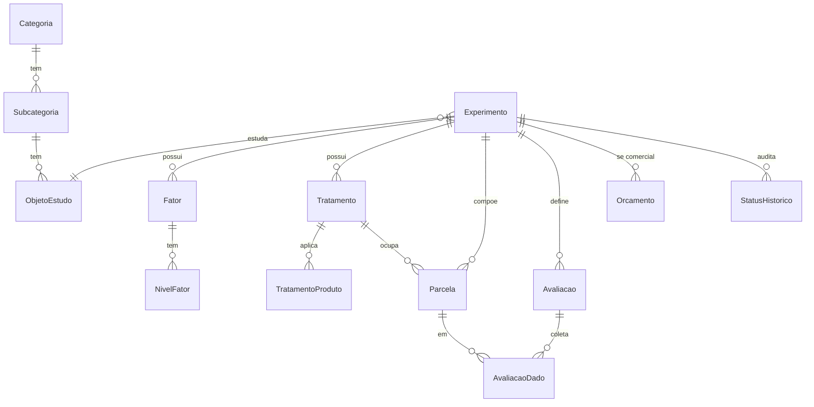

# 01 — Modelo de dados

Modelo proposto (MySQL via Prisma), derivado do banco legado `BD/expagrolab.sql` mas **normalizado** e **sync-friendly** (UUID, timestamps, soft-delete). Nomes de domínio em PT.

## Princípios
- **PK `id` UUID** (string) em entidades sincronizáveis (estáveis entre offline/online).
- `createdAt`, `updatedAt`, `deletedAt` (soft-delete) em tudo que sincroniza ou audita.
- **Fluxo** representado por `Experimento.ensaio` (`interno`|`comercial`), não por colunas duplicadas (no legado havia `orcamento` e `os` lado a lado).
- Objeto de estudo **genérico** via `Categoria → Subcategoria → ObjetoEstudo`.

## Entidades centrais

### Objeto de estudo (genérico)
- **Categoria** (`id, nome, ativo`) — ex.: Cultura, Máquina, Pessoa. (legado `objetos_categorias`)
- **Subcategoria** (`id, categoriaId, nome, ativo`) — ex.: Soja, Pulverizador, Atleta. (legado `objetos_subcategorias`)
- **ObjetoEstudo** (`id, subcategoriaId, nome, obs, ativo`) — ex.: "FM 944 GL". (legado `objetos_estudos`)

### Cadastros de apoio
- **Local** (`id, nome`) · **Safra** (`id, nome` ex "25/26") · **UnidadeAmostral** (`id, nome`) · **Atividade** (`id, nome, valorVenda, ativo`) · **Delineamento** (`id, nome` ex DIC/DBC/Fatorial) · **AreaPesquisa** (`id, nome` ex Matologia/Entomologia) · **Marca** (`id, nome`) · **Produto** (`id, nome, marcaId, ...`).

### Experimento (protocolo)
**Experimento** (legado `os`/`orcamentos` + metadados do print "Geral"):
```
id (uuid), codigo (ex PC1699), titulo, objetivo,
ensaio: enum(interno|comercial),
areaPesquisaId, objetoEstudoId, cultivar,
localId, safraId, delineamentoId,
tipoExecucao (ex Plataforma), metodologia, justificativa, observacoes,
parcelaLarguraM, parcelaComprimentoM, parcelaNumLinhas,
espacamentoLinhasM,   // usado no cálculo de área útil na colheita (RN-PROD)
numRepeticoes (blocos), numTratamentos, totalParcelas,
previsaoSemeadura (date), dataSemeadura (date),
status: enum (Inserindo, AprovadoCAD, RecusadoCAD, EmConducao, Concluido),
analistaId (User), clienteId (nullable, fluxo comercial),
createdAt, updatedAt, deletedAt
```

### Fatores e tratamentos
- **Fator** (`id, experimentoId, ordem(1..3), nome, tipo: enum(qualitativo|quantitativo)`).
- **NivelFator** (`id, fatorId, valor, rotulo`).
- **Tratamento** (`id, experimentoId, numeroRef(T1..Tn), tag, descricao, nome`) — combina níveis. (legado `tratamentos`)
- **TratamentoNivel** (`tratamentoId, nivelFatorId`) — N:N (qual nível de cada fator compõe o tratamento).
- **TratamentoProduto** (`id, tratamentoId, produtoId, modoAplicacao, dose, unidadeDose, volumeCaldaLha, referencia, timingId, atividadeId, seq, descricao`). (legado `produtos_timings`/`dados_experimentos`)
- **Timing** (`id, experimentoId, nome` ex "1ª Aplicação", "5 dias após 1ª Aplicação", condicional/calendarizado).

### Croqui / parcelas
- **Parcela** (legado célula do croqui):
```
id (uuid), experimentoId, tratamentoId, bloco (repetição),
numero (ex 43958), posLinha, posColuna (grid),
isInicio (bool), cor (derivada do tratamento),
createdAt, updatedAt
```
- **CroquiLayout** (`id, experimentoId, numLinhas, numColunas, sentidoCaminhamento, parcelaInicioId, jsonLayout`) — guarda o layout final editado (drag-drop).

### Avaliações
- **Avaliacao** (definição da variável):
```
id, experimentoId (ou template global), nome, metodologia,
unidadeColeta (ex kg/parcela), unidadeSaida (ex kg/ha),
formula (expressão de conversão; ver RN-CALC),
tipo: enum(calendarizada|condicional), personalizada (bool),
timingId (quando/condição), escala (nullable, p/ notas 0-100),
dataPrevista (nullable), ordem, valorComercial (nullable)
```
- **AvaliacaoDado** (lançamento por parcela; legado `dados_experimentos`):
```
id (uuid), avaliacaoId, parcelaId, numAmostra,
valorColetado (decimal),   // VALOR BRUTO coletado no campo (ex.: kg/parcela)
// apontamentos da ATIVIDADE de colheita (RN-PROD), registrados na atividade:
numLinhasColhidas (nullable), comprimentoColhidoM (nullable), areaUtilM2 (nullable),
obs, status, fotoUrl (nullable),
origem: enum(web|mobile), dispositivoId,
syncedAt, createdAt, updatedAt, deletedAt
```
> ⚠️ **A coleta guarda o valor bruto + os apontamentos da atividade** (linhas, comprimento, área útil — `areaUtilM2 = numLinhasColhidas × espacamentoLinhasM(Experimento) × comprimentoColhidoM`). **O valor de produtividade (kg/ha) é apresentado apenas no relatório**, derivado do bruto ÷ área útil × 10.000 — não persistido na linha de coleta. O mobile registra apontamentos brutos; a produtividade final é cálculo do relatório.

### Fluxo comercial
- **Cliente** (`id, nome, ...`). (legado `clientes`)
- **Orcamento** (`id, experimentoId, clienteId, status, total`) + **OrcamentoItem** (`id, orcamentoId, tipo: avaliacao|atividade|produto, refId, quantidade, valorUnit, valorTotal`). (legado `orcamentos`/`servicos_orc`/`produtos_orc`)

### Multi-tenancy (instituição / unidade)
- **Instituicao** (`id, nome, cnpj?, ativo`) — tenant raiz. (RF-20)
- **Unidade** (`id, instituicaoId, nome, tipo: enum(unidade|laboratorio), ativo`). (RF-21)
- **User** (`id, instituicaoId, unidadeId?, nome, email (unique), senhaHash, isAdminInstituicao (bool), ativo`). Admin da instituição cadastra usuários. (RF-22)
- **Papel/Permissao** — ver [05-seguranca](../05-seguranca/01-autenticacao-autorizacao.md) (legado `acessos`/`grupo_acessos`/`usuarios_permissoes`). Escopo por `instituicaoId` (RN-TENANT).

### Compartilhamento de experimento (RF-23..25)
- **ExperimentoCompartilhamento** (`id, experimentoId, userId (com quem), nivel: enum(input|edit), criadoPorId (dono), aceito (bool), convidadoEmail?, token?, createdAt`). `Experimento.ownerId` define o dono. Timeline agrega experimentos próprios + compartilhados.

### Fluxo comercial — Ordem de Serviço e aprovações (RF-26)
- **OrdemServico** (`id, experimentoId, orcamentoId?, status: enum(rascunho|aguardando_aprovacao_interna|aguardando_aprovacao_cliente|aprovada|recusada), createdAt`).
- **AprovadorInstituicao** (`id, instituicaoId, userId, ativo`) — quem pode aprovar OS internamente. Política em `Instituicao.politicaAprovacao: enum(todos|n_de_m)` (+ `nAprovadores`).
- **AprovacaoOSInterna** (`id, ordemServicoId, aprovadorUserId, decisao: enum(aprovado|recusado), motivo?, at`).
- **AprovacaoCliente** (`id, ordemServicoId, clienteEmail, token (unique), decisao: enum(pendente|aprovado|recusado), motivo?, decididoEm?, ip?`). Link enviado por e-mail.
- **EmailLog** (`id, tipo, para, assunto, htmlPath? (modo SIMULATE), status: enum(simulado|enviado|erro), erro?, refTipo?, refId?, createdAt`) — espelha o envio do SAGRE com modo preview.

### Auditoria
- **StatusHistorico** (`id, experimentoId, de, para, userId, at`) — trilha de status.

## ER simplificado


## Notas de migração do legado
- `dados_experimentos` (denormalizada) → dividida em `Parcela`, `TratamentoProduto` e `AvaliacaoDado`.
- Pares `orcamento`/`os` no legado → `Experimento.ensaio` + `Orcamento` opcional.
- `config`/`config3`, módulos financeiros (`pagar`, `receber`, `entradas`, `saidas`, `estoque`) **fora do MVP**; migrar só se o fluxo comercial exigir.

## Área útil colhida e produtividade (RN-PROD) — definido
- **Atividade de colheita (apontamentos):** registra `valorColetado` bruto + `numLinhasColhidas` + `comprimentoColhidoM` + `areaUtilM2` (= linhas × `espacamentoLinhasM` do experimento × comprimento) em `AvaliacaoDado`.
- **Relatório (apresentação):** apresenta a **produtividade** `kg_ha = valorColetado ÷ areaUtilM2 × 10.000`. Derivada em tempo de relatório, não persistida na linha de coleta.
